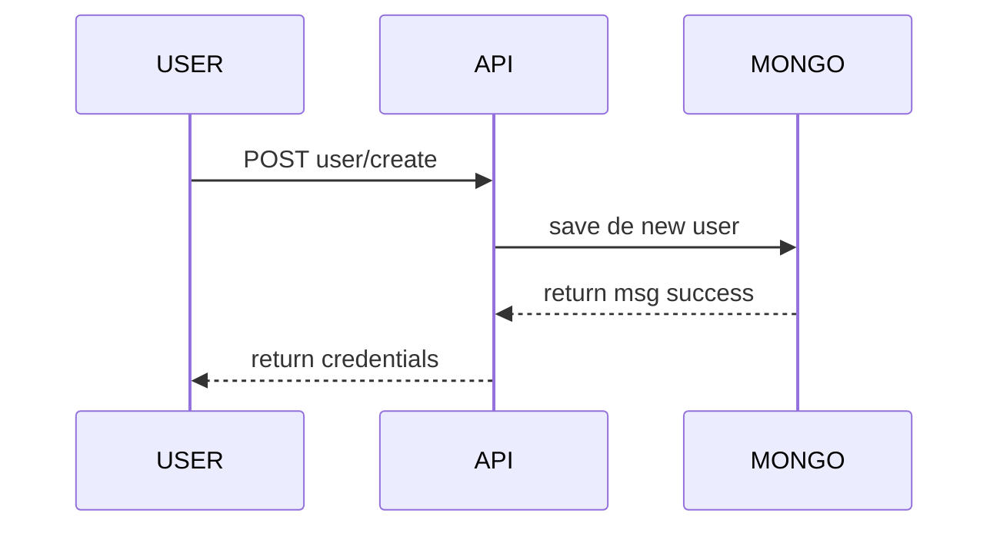
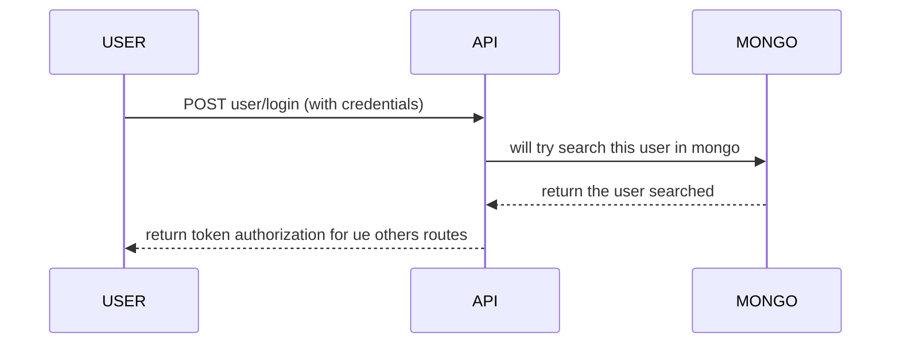
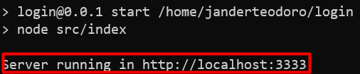

# Login API

This is a login API, using JWT authorizer for validate some routes. For running this application locally, you will need have a node 14.x installed at yout machine.


## Big Picture's

**create user**

simple route for create new user saving in mongo


**login user**

This route is really import, because for use the others, you will need make the login, in othes words, use this route to have a token authorziation.


## Ambient Varibales
```
MONGO_URI=Your connection string with mongo
DB_USER=Login
COLLECTION_USER=users
SECRET=yourSecret
```

## For install... 
```
npm install
```

## For running
```
npm start
```
Then in your terminal will show this message, like this:


Your server will be running at port that ambient variable or, automatically, 3333.
